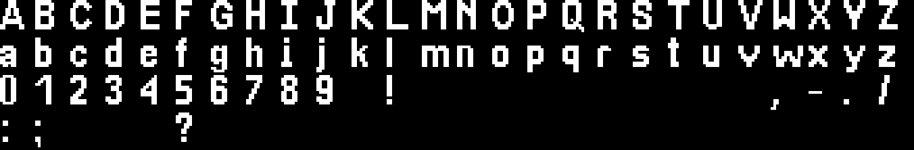
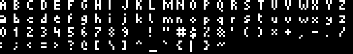
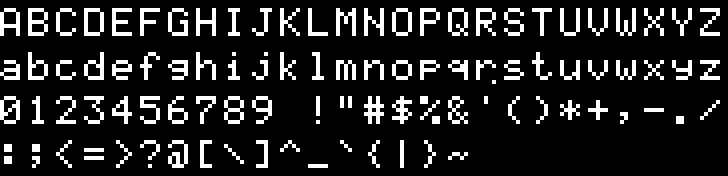

# LED Matrix Sign

[](img/led-matrix-sign.jpg)

## Setup

Install Python dependencies.

```bash
pip install -r requirements.txt
```

Install the Adafruit RGB Matrix library.

```bash
curl https://raw.githubusercontent.com/adafruit/Raspberry-Pi-Installer-Scripts/refs/heads/main/rgb-matrix.sh > rgb-matrix.sh
sudo bash rgb-matrix.sh
```

Turn off the Raspberry Pi's integrated audio card.

```bash
sudo nano /boot/firmware/config.txt # set "dtparam=audio=off"
sudo nano /etc/modprobe.d/alsa-blacklist.conf # add "blacklist snd_bcm2835"
```

### Button

The side button is connected to GPIO pin 25. It has the following functionality:
 * Short press: Cycle through the available modes.
 * Long press (3 seconds): Power off the Raspberry Pi.

In order to setup the shutdown functionality, the `daemon` user needs to be
allowed to shutdown the system without root privileges. To accomplish this, open
the following file:

```bash
sudo visudo -f /etc/sudoers.d/shutdown
```

And add the following line to the file:

```
daemon ALL=(ALL) NOPASSWD: /sbin/shutdown
```

## Run

Sudo is required in order to access hardware registers. Performance will be much
worse without it.

```bash
sudo python3 main.py
```

### Run at system startup

First, edit the `led-matrix-sign.service` file to set the correct path to the
Python script. Then, run the following commands:

```bash
sudo cp led-matrix-sign.service /etc/systemd/system/
sudo chmod 644 /etc/systemd/system/led-matrix-sign.service
sudo systemctl daemon-reload
sudo systemctl enable led-matrix-sign.service
sudo systemctl start led-matrix-sign.service
# to check logs
sudo journalctl -u led-matrix-sign.service
```

## Fonts

The `MBTASans` and `MTASans` fonts were generated by using the
[Online Pixel Font Creator](https://matteosandrin.github.io/online-pixel-font-creator)
tool. To edit this font, upload either the `.otf` or `.pfs` file to the tool and
make your changes.

### MBTA Sans


### MTA Sans



### Picopixel



### Silkscreen


### 5x8 LCD HD44780U

