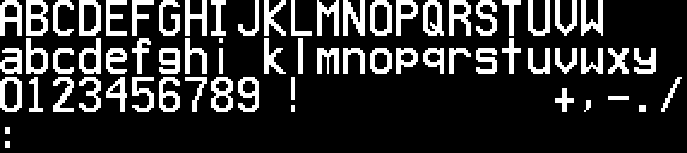

# Fonts

The `MBTASans` and `MTASans` fonts were generated by using the
[Online Pixel Font Creator](https://matteosandrin.github.io/online-pixel-font-creator)
tool. To edit this font, upload either the `.otf` or `.pfs` file to the tool and
make your changes.

## MBTA Sans

## MTA Sans

## Picopixel

## Silkscreen

## 5x8 LCD HD44780U

